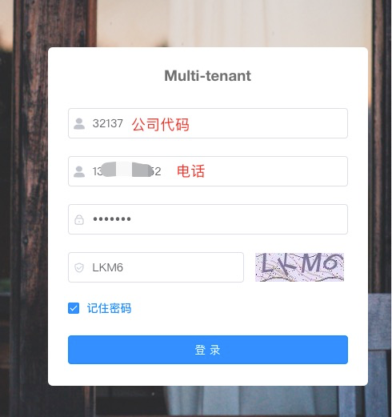

# Multi-Tenant-SaToken

[简体中文](https://gitee.com/willf/springboot-multi-tenant-sa-token/blob/master/README_zh.md)

#### Introduction
Multi-Tenant-SaToken is an upgraded version of [RuoYi-Vue-Multi-Tenant](https://gitee.com/leslie8195/ruo-yi-vue-multi-tenant) （SpringBoot，sa-token，mybatis-plus，Vue & Element），It is a simple, elegant, and lightweight framework for a multi-tenant system.

[github](https://github.com/u3breeze/Springboot-Multi-Tenant-SaToken)

#### Upgrades and optimizations
1. Refactored the authentication module for permissions, replacing Spring Security with [sa-token](https://sa-token.cc) to simplify and streamline authentication.
2. Integrated jwt with Sa-Token([Simple mode](https://sa-token.cc/doc.html#/plugin/jwt-extend)) 
3. Upgraded Spring Boot to 2.6.8.
4. Upgraded MyBatis to MyBatis-Plus.
5. Upgraded Swagger and used Knife4j to enhance document generation.
6. Optimized the handling of permissions for super administrators and tenant administrators, uniformly managed by sa-token without the need for manual if statements.
7. Upgraded dependency package versions.
8. User accounts are isolated by tenants, and different tenants can use the same account.

#### Environment and deployment

##### admin ui(/ruoyi-ui)
Local launch:
   ```
   yarn install
   yarn dev
   ```

Build:
   ```
    测试环境：yarn build:stage
    生产环境：yarn build:prod
   ```
##### API Server (/ruoyi)
mysql:
   ```
   create database：mtt
   sql file：/ruoyi/sql/multi_tenant.sql
   ```
Redis：
   ```
   dev properties：application-dev.properties
   # redis config:
   spring.redis.host=127.0.0.1
   spring.redis.port=6379
   spring.redis.database=11
   spring.redis.password=
   ```
Sa-Token Redis：
   ```
   dev properties：application-dev.properties
   # Sa-Token插件：配置Sa-Token单独使用的Redis database连接，权限缓存与业务缓存分离。
   # Redis数据库索引
   sa-token.alone-redis.database=10
   # Redis服务器地址
   sa-token.alone-redis.host: 127.0.0.1
   # Redis服务器连接端口
   sa-token.alone-redis.port: 6379
   # Redis服务器连接密码（默认为空）
   sa-token.alone-redis.password:
   ``` 
### Instructions

After the front and back ends are started, access the address: http://localhost:1024/

Log in to the background of the tenant management system as the admin and admin123 system administrator (tenant Code is not specified) to manage menus and tenants.

Login System Admin

Add Menu Template

Add Tenant


Login Tenant, http://localhost:1024/


#### Acknowledgements
1. [sa-token](https://sa-token.cc) Lightweight Java authentication framework for permissions.
2. [RuoYi-Vue-Multi-Tenant](https://gitee.com/leslie8195/ruo-yi-vue-multi-tenant) Multi-tenant framework based on RuoYi-Vue.
