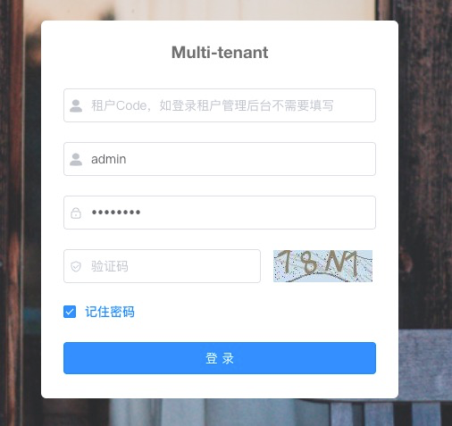
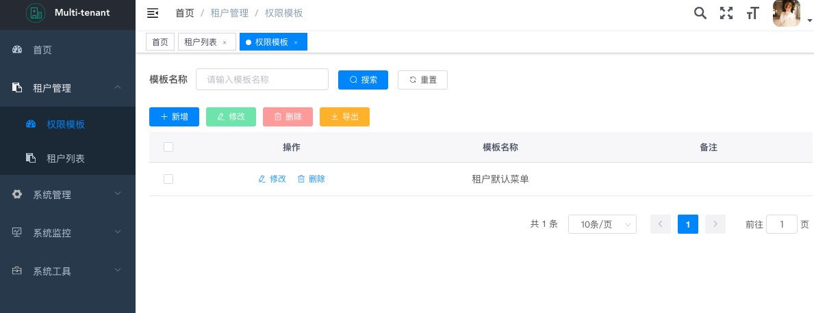
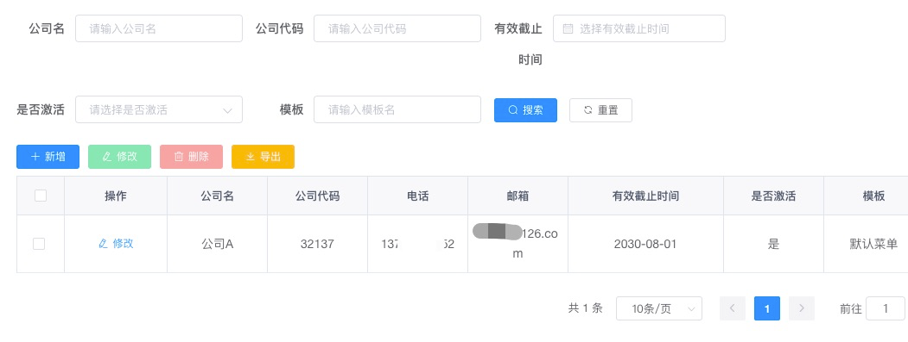
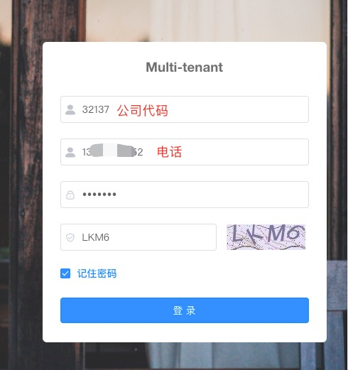

# Multi-Tenant-SaToken

[English](https://gitee.com/willf/springboot-multi-tenant-sa-token/blob/master/README.md)

### 介绍
此项目 Multi-Tenant-SaToken 是基于[RuoYi-Vue-Multi-Tenant](https://gitee.com/leslie8195/ruo-yi-vue-multi-tenant) 的升级版（SpringBoot，sa-token，mybatis-plus，Vue & Element），是一个简约、优雅、轻量级的多租户系统的脚手架。

[github地址](https://github.com/u3breeze/Springboot-Multi-Tenant-SaToken)

### 升级和优化
1. 重构权限认证模块，替换spring security，使用 [sa-token](https://sa-token.cc) 让鉴权更简单、优雅。
2. Sa-Token整合jwt([Simple简单模式](https://sa-token.cc/doc.html#/plugin/jwt-extend)) 
3. springboot升级到2.6.8。
4. 升级mybatis为mybatis-plus。
5. 升级swagger，使用knife4j增强文档生成。
6. 优化超级管理员和租户管理员的权限处理，统一交给sa-token，无需要手动if判断。
7. 升级依赖包版本。
8. 用户账号通过租户隔离，不同租户可以使用相同的账号。


### 环境和部署
环境和部署可查看[RuoYi-Vue-Multi-Tenant](https://gitee.com/leslie8195/ruo-yi-vue-multi-tenant) ，方式一样。
##### 前端(/ruoyi-ui)
   
   本地启动：
   ```
   yarn install
   yarn dev
   ```
    
   编译构建：
   ```
    测试环境：yarn build:stage
    生产环境：yarn build:prod
   ```
##### 后端(/ruoyi)
数据库创建：
   ```
   创建数据库：mtt
   执行sql：/ruoyi/sql/multi_tenant.sql
   ```
Redis配置：
   ```
   测试环境：application-dev.properties
   # redis 配置
   spring.redis.host=127.0.0.1
   spring.redis.port=6379
   spring.redis.database=11
   spring.redis.password=
   ```
Sa-Token Redis配置：
   ```
   测试环境：application-dev.properties
   # Sa-Token插件：配置Sa-Token单独使用的Redis database连接，权限缓存与业务缓存分离。
   # Redis数据库索引
   sa-token.alone-redis.database=10
   # Redis服务器地址
   sa-token.alone-redis.host: 127.0.0.1
   # Redis服务器连接端口
   sa-token.alone-redis.port: 6379
   # Redis服务器连接密码（默认为空）
   sa-token.alone-redis.password:
   ``` 
### 使用说明
前后端启动后，访问前端地址：http://localhost:1024/

使用系统管理员账号：admin/admin123， 登录租户管理系统后台（租户Code不填写），管理菜单和租户。

登录系统管理

添加菜单模版

添加租户


租户后台登录，http://localhost:1024/



### 感谢
1. [sa-token](https://sa-token.cc) 轻量级 java 权限认证框架
2. [RuoYi-Vue-Multi-Tenant](https://gitee.com/leslie8195/ruo-yi-vue-multi-tenant) 基于RuoYi-Vue扩展的多租户框架
